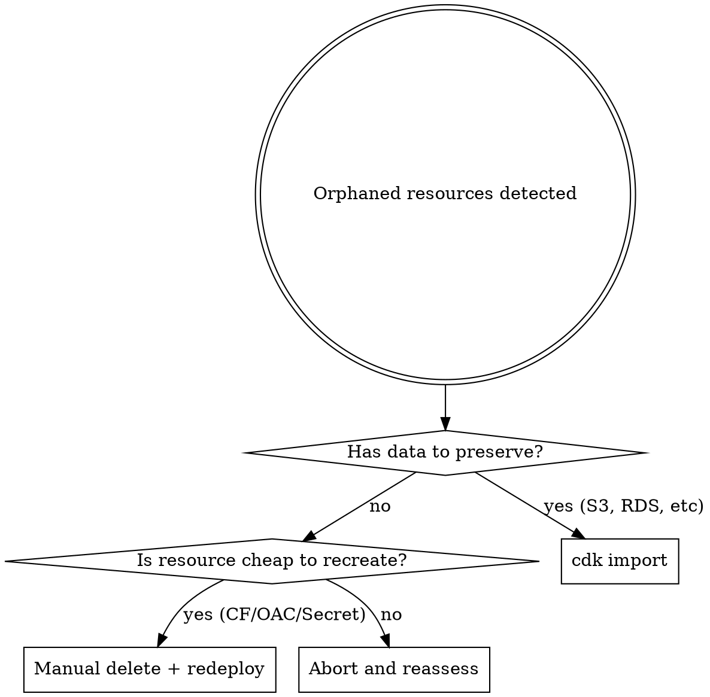

# Orphaned Resource Recovery

Reference for recovering when AWS resources exist outside CloudFormation tracking and collide with new CDK deployments.

## Decision Tree



## Common Orphan Types

| Resource | Survives stack delete via | Cheap to recreate? |
|---|---|---|
| `AWS::S3::Bucket` | `RemovalPolicy: RETAIN` | No (data loss) |
| `AWS::CloudFront::Distribution` | Disable→delete is async | Yes (5-10 min create) |
| `AWS::CloudFront::OriginAccessControl` | Distribution still references it | Yes (instant) |
| `AWS::Lambda::Function` (edge) | Replicas in regions, distribution refs | Yes |
| `AWS::SecretsManager::Secret` | `RemovalPolicy: RETAIN` or recovery window | Depends (lose values) |

## Path A: cdk import (preserve data)

Use when the orphan holds data you cannot lose (S3 with content, RDS, etc).

1. Verify the orphan's physical ID and properties match what CDK expects
2. Author a `resource-mapping.json`:
   ```json
   {
     "ReportsViewerBucketA5A445C5": { "BucketName": "<existing-bucket-name>" }
   }
   ```
3. Run import:
   ```bash
   npx cdk import <StackName> --resource-mapping resource-mapping.json --profile <profile>
   ```
4. After import succeeds, run `cdk deploy` to reconcile non-imported resources
5. Verify with `cdk diff` showing no changes

**Caveats:**
- Properties on the imported resource must match the CDK-synthesized template, or `cdk diff` will show drift on next deploy
- Some resources are not importable (check AWS docs)
- Stack must be in `CREATE_COMPLETE` or `UPDATE_COMPLETE` state to import (not `ROLLBACK_COMPLETE`)

## Path B: Manual delete + redeploy

Use when the orphan is cheap to recreate (CloudFront, OAC, Lambda@Edge, ephemeral Secret).

### Dependency order matters

Delete in reverse-dependency order:
1. CloudFront Distribution (disable → wait for `Deployed` → delete)
2. Lambda@Edge replicas (auto-cleaned ~hours after distribution removal)
3. OriginAccessControl (after distribution gone)
4. Secrets Manager Secret (after Lambda@Edge gone)
5. S3 Bucket (only if no data to preserve; empty → delete)

### Quick deletion commands

```bash
# CloudFront: disable
aws cloudfront get-distribution-config --id <DistID> --profile <profile> > /tmp/cf.json
ETAG=$(jq -r .ETag /tmp/cf.json)
jq '.DistributionConfig | .Enabled = false' /tmp/cf.json > /tmp/cf-disabled.json
aws cloudfront update-distribution --id <DistID> --if-match $ETAG \
  --distribution-config file:///tmp/cf-disabled.json --profile <profile>

# Wait for status to be Deployed (5-15 min)
aws cloudfront wait distribution-deployed --id <DistID> --profile <profile>

# Then delete
aws cloudfront delete-distribution --id <DistID> --if-match <new-etag> --profile <profile>

# OAC
aws cloudfront delete-origin-access-control --id <OACId> --if-match <etag> --profile <profile>

# Secret (no recovery window)
aws secretsmanager delete-secret --secret-id <name> --force-delete-without-recovery --profile <profile>

# S3 (empty first)
aws s3 rm s3://<bucket-name> --recursive --profile <profile>
aws s3api delete-bucket --bucket <bucket-name> --profile <profile>
```

### Path B Variant: Remove OAC reference without deleting Distribution

If you want to keep the CloudFront distribution running (e.g., until DNS cuts over), remove just the OAC reference:

```bash
ETAG=$(aws cloudfront get-distribution-config --id <DistID> --profile <profile> --query 'ETag' --output text)
aws cloudfront get-distribution-config --id <DistID> --profile <profile> \
  --query 'DistributionConfig' \
  | python3 -c "
import json, sys
cfg = json.load(sys.stdin)
for o in cfg['Origins']['Items']:
    o['OriginAccessControlId'] = ''
print(json.dumps(cfg))
" > /tmp/cf_no_oac.json
aws cloudfront update-distribution --id <DistID> --if-match $ETAG \
  --distribution-config file:///tmp/cf_no_oac.json --profile <profile>
# Wait for Deployed, then delete the OAC
```

## Path C: Abort

If neither import nor delete is acceptable (data is irreplaceable AND import has drift), stop and reassess with the user. Possible exits:
- Restructure CDK code to use existing resource as input prop instead of creating it
- Deploy to a new stack with a different name and migrate data
- Accept the orphan as out-of-band and document it

## Verification After Recovery

After the recovery path completes, run the full preflight again:

```bash
aws cloudformation describe-stacks --stack-name <StackName> --profile <profile>  # OK or NotExist
npx cdk diff <StackName> --profile <profile>                                      # Expected diff only
```

Then proceed with `cdk deploy`.
